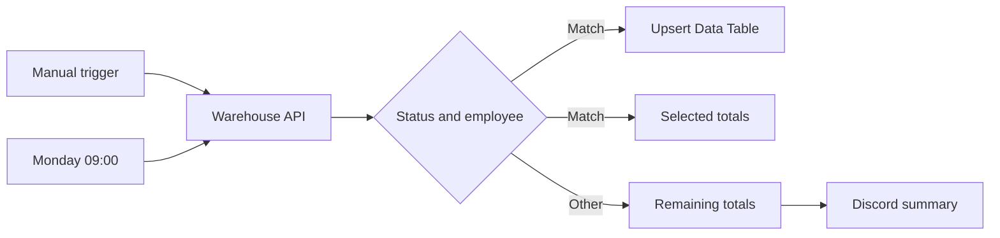

# Warehouse Order Processing Automation

> **Navigation:** [Course portfolio](../../) › Module 01 › Warehouse Order Processing

Production-style workflow completed during the **Getting Started** module of the official n8n Academy QS101 Quickstart course.

## Business objective

Automate the retrieval, classification, aggregation, storage, and notification of warehouse order data while supporting both manual and scheduled execution.

## Architecture

## Workflow stages

| Stage | Node | Responsibility |
| --- | --- | --- |
| Trigger | `Trigger Manually` | Run the workflow on demand |
| Trigger | `TriggerMondays9am` | Run every Monday at 09:00 |
| Retrieve | `GetDataFromWarehouse` | Request warehouse orders using Header Auth |
| Decide | `CheckOrderStatus` | Match processing orders assigned to Mario |
| Persist | `UpsertOrders` | Insert or update matching orders |
| Calculate | Code nodes | Calculate order counts and monetary totals |
| Notify | `Discord` | Send the weekly summary |

## Expected behavior

- Both triggers feed the same authenticated request.
- Matching records are persisted without creating duplicate order rows.
- Both branches calculate independent totals.
- The Discord message reports the order count and rounded monetary value.

## Import and configure

1. Download [`workflow.json`](./workflow.json).
2. In n8n, select **Import from File**.
3. Replace `YOUR_ASSESSMENT_ID` with your own Academy assessment ID.
4. Configure an authorized HTTP Header Auth credential.
5. Create the required `orders` Data Table and select it in `UpsertOrders`.
6. Configure your Discord Webhook credential.
7. Review the `America/Sao_Paulo` timezone before publishing.

## Security

The public export contains no credential objects, private webhook URLs, workflow IDs, or private instance metadata. Credentials must be configured only inside your own n8n instance.

---

[Back to course portfolio](../../)
