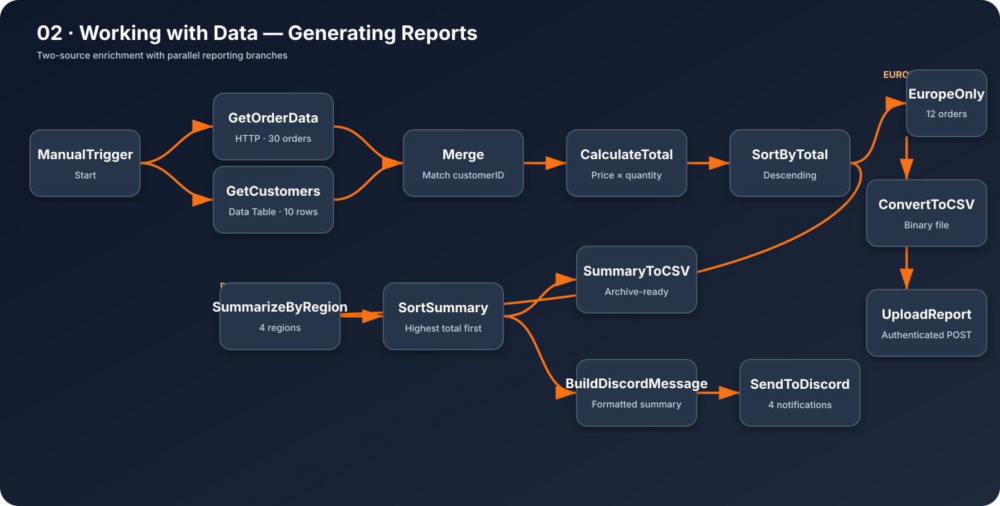
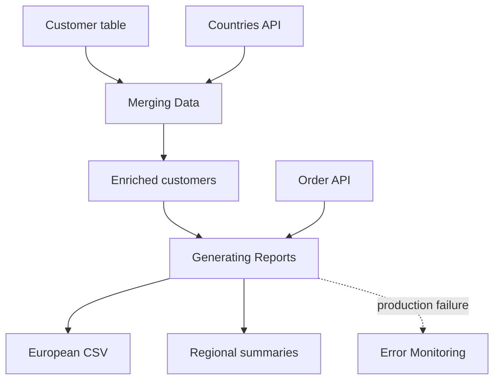

# Working with Data

This module contains three connected n8n workflows completed during the **Working with Data** section of the official n8n Academy QS101 Quickstart course.

## Learning outcomes

- Read and update records in n8n Data Tables
- Retrieve structured data from authenticated APIs
- Merge datasets by matching fields
- Calculate, sort, filter, and summarize order data
- Convert JSON data to CSV binary files
- Upload reports through authenticated HTTP requests
- Send regional summaries through Discord webhooks
- Monitor production failures with a reusable Error Workflow

## Workflows

| Workflow | Purpose | Key nodes |
| --- | --- | --- |
| [Merging Data](./merging-data/) | Enrich customer records with region and subregion data | Data Table, HTTP Request, Merge |
| [Generating Reports](./generating-reports/) | Produce a European CSV report and regional sales summaries | Merge, Edit Fields, Sort, Filter, Summarize, Convert to File, Discord |
| [Error Monitoring](./error-monitoring/) | Notify the team when the reporting workflow fails in production | Error Trigger, Edit Fields, Discord |

## Architecture

## Import order

1. Import and run `merging-data/workflow.json`.
2. Confirm the `customers` Data Table contains populated `region` and `subregion` fields.
3. Import and run `generating-reports/workflow.json`.
4. Import and publish `error-monitoring/workflow.json`.
5. Select **Monitor Report Errors** as the Error Workflow in the **Generating Reports** settings.

All assessment IDs and credential references have been removed from the public exports. Configure your own authorized credentials after importing.
