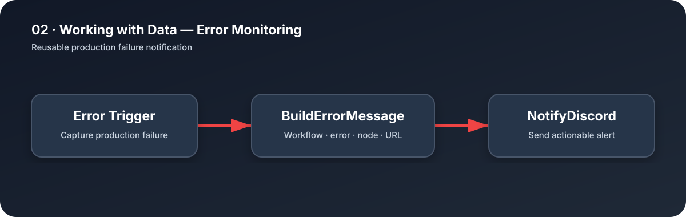

# Error Monitoring

A reusable Error Workflow that formats production failure details and sends a Discord notification.

## Alert contents

- Failed workflow name
- Error message
- Last executed node
- Direct execution URL

## Setup

1. Import `workflow.json`.
2. Replace `YOUR_ASSESSMENT_ID`.
3. Configure an authorized Discord Webhook credential.
4. Publish the workflow.
5. Select it as the Error Workflow of **Generating Reports**.

Manual tests use n8n sample error data. Production executions include the real failure details.
