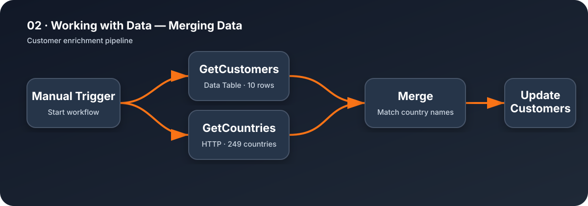

# Merging Data

Enriches ten customer records with geographic data from the n8n Academy Countries API.

## Flow

1. Read all records from the `customers` Data Table.
2. Retrieve the countries dataset through HTTP.
3. Match `customerCountry` with the country `name`.
4. Update only the `region` and `subregion` fields for each customer row.

## Expected result

- 10 customer records retrieved
- 249 country records retrieved
- 10 matched records
- 10 customer rows updated

## Setup

Import `workflow.json`, create the required `customers` Data Table from the course CSV, select it in both Data Table nodes, and execute the workflow manually.
