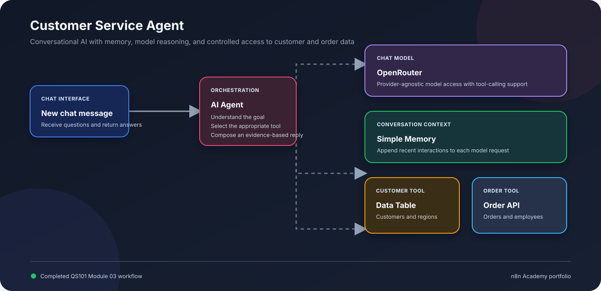

# Building an AI Agent

This module documents the customer service agent completed during the **Building an AI Agent** section of the official n8n Academy QS101 Quickstart course.

## Learning outcomes

- Distinguish deterministic workflows from non-deterministic AI agents
- Connect a chat model to the n8n AI Agent node
- Preserve conversational context with Simple Memory
- Expose Data Tables and authenticated APIs as agent tools
- Write clear tool descriptions and system instructions
- Inspect tool calls and validate answers against real data

## Project

| Workflow | Purpose | Key nodes |
| --- | --- | --- |
| [Customer Service Agent](./customer-service-agent/) | Answer customer and order questions using conversation memory and live data tools | Chat Trigger, AI Agent, OpenRouter Chat Model, Simple Memory, Data Table Tool, HTTP Request Tool |

## Agent capabilities

The agent can retain recent conversation context, retrieve customer records from the `customers` Data Table, and query the Academy order endpoint. Its system message requires concise, evidence-based answers and explicitly prevents fabricated information.

## Import and configure

1. Import `customer-service-agent/workflow.json`.
2. Configure an OpenRouter credential and select a model that supports tool calling.
3. Select your local `customers` Data Table in `GetCustomers`.
4. Configure the Academy Header Auth credential in `GetOrderData`.
5. Replace `YOUR_ASSESSMENT_ID` with your personal Academy assessment ID.
6. Test both tools from the chat before publishing.

Credentials, personal identifiers, Data Table IDs, project paths, and instance metadata have been removed from the public export.

---

[Back to course portfolio](../)
