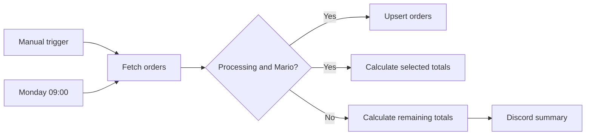

# n8n Academy QS101 — Course Labs


A structured portfolio of hands-on workflow automation projects completed during the official **n8n Academy QS101: n8n Quickstart** course.

This repository documents my practical learning journey with n8n, including workflow orchestration, APIs, data transformation, conditional logic, scheduling, JavaScript Code nodes, external integrations, and AI agents.

> **Educational attribution:** The exercises and learning path are based on the official n8n Academy QS101 course. This repository contains my own workflow implementations, notes, validation, and portfolio documentation. n8n and the n8n logo are trademarks of n8n GmbH.

## Course progress

| Module | Status | Portfolio artifact |
| --- | --- | --- |
| 01 — Getting Started | ✅ Completed | Warehouse Order Processing Automation |
| 02 — Working with Data | ✅ Completed | Data Enrichment, Reporting, and Error Monitoring |
| 03 — Building an AI Agent | ⬜ Not started | Coming soon |
| 04 — Final Exam and Wrap Up | ⬜ Not started | Coming soon |

## Completed project

### 01 — Warehouse Order Processing Automation

An automated warehouse workflow that retrieves order data, applies combined business rules, calculates financial totals, updates an n8n Data Table, and sends a Discord summary. It supports manual execution and a weekly Monday 09:00 schedule.

Key concepts demonstrated:

- Manual and scheduled triggers
- Authenticated HTTP requests
- Conditional routing with multiple `AND` rules
- JavaScript aggregation using Code nodes
- Data Table upsert operations
- Discord webhook notifications
- Timezone-aware scheduling
- Secure workflow export for a public repository

### 02 — Data Enrichment, Reporting, and Error Monitoring

A three-workflow reporting system that enriches customer records with geographic data, merges orders with customer details, calculates and filters sales totals, creates CSV reports, publishes regional Discord summaries, and monitors production failures.

Key concepts demonstrated:

- Data Tables and row-level updates
- API authentication and assessment headers
- Field-based dataset merging
- Derived numeric fields, sorting, and filtering
- Regional aggregation and CSV conversion
- Binary file uploads
- Parallel workflow branches
- Reusable Error Workflows

See the complete [Working with Data module](./02-working-with-data/).

## Architecture



## Repository structure

```text
.
├── 01-getting-started/
│   └── warehouse-order-processing/
│       ├── README.md
│       └── workflow.json
├── 02-working-with-data/
│   ├── README.md
│   ├── merging-data/
│   ├── generating-reports/
│   └── error-monitoring/
├── 03-building-an-ai-agent/       # Added as lessons are completed
├── 04-final-exam/                 # Added after completion
├── .github/workflows/
│   └── validate-workflow.yml
├── SECURITY.md
└── README.md
```

## Security

Public workflow exports in this repository do not contain credentials, API keys, assessment IDs, private webhook URLs, workflow IDs, or private n8n instance metadata. Public n8n Academy exercise endpoints are retained for reproducibility. Each workflow must be configured with your own authorized credentials after import.

## About me

**Diego Rafael Leao Garcia**  
Automation and AI Engineering student focused on n8n, Python, APIs, databases, Docker, and applied artificial intelligence.

## Disclaimer

This is an independent educational portfolio and is not an official n8n repository. For the original training, documentation, and certification path, visit the official n8n Academy and n8n documentation.
# n8n Academy QS101 — Course Labs


A structured portfolio of hands-on workflow automation projects completed during the official **n8n Academy QS101: n8n Quickstart** course.

This repository documents my practical learning journey with n8n, including workflow orchestration, APIs, data transformation, conditional logic, scheduling, JavaScript Code nodes, external integrations, and AI agents.

> **Educational attribution:** The exercises and learning path are based on the official n8n Academy QS101 course. This repository contains my own workflow implementations, notes, validation, and portfolio documentation. n8n and the n8n logo are trademarks of n8n GmbH.

## Course progress

| Module | Status | Portfolio artifact |
| --- | --- | --- |
| 01 — Getting Started | ✅ Completed | Warehouse Order Processing Automation |
| 02 — Working with Data | 🚧 In progress | Coming next |
| 03 — Building an AI Agent | ⬜ Not started | Coming soon |
| 04 — Final Exam and Wrap Up | ⬜ Not started | Coming soon |

## Completed project

### 01 — Warehouse Order Processing Automation

An automated warehouse workflow that retrieves order data, applies combined business rules, calculates financial totals, updates an n8n Data Table, and sends a Discord summary. It supports manual execution and a weekly Monday 09:00 schedule.

Key concepts demonstrated:

- Manual and scheduled triggers
- Authenticated HTTP requests
- Conditional routing with multiple `AND` rules
- JavaScript aggregation using Code nodes
- Data Table upsert operations
- Discord webhook notifications
- Timezone-aware scheduling
- Secure workflow export for a public repository

## Architecture


## Repository structure

```text
.
├── 01-getting-started/
│   └── warehouse-order-processing/
│       ├── README.md
│       └── workflow.json
├── 02-working-with-data/          # Added as lessons are completed
├── 03-building-an-ai-agent/       # Added as lessons are completed
├── 04-final-exam/                 # Added after completion
├── .github/workflows/
│   └── validate-workflow.yml
├── SECURITY.md
└── README.md
```

## Security

Public workflow exports in this repository do not contain credentials, API keys, assessment IDs, webhook URLs, workflow IDs, or private n8n instance metadata. Each workflow must be configured with your own credentials after import.

## About me

**Diego Rafael Leao Garcia**  
Automation and AI Engineering student focused on n8n, Python, APIs, databases, Docker, and applied artificial intelligence.

## Disclaimer

This is an independent educational portfolio and is not an official n8n repository. For the original training, documentation, and certification path, visit the official n8n Academy and n8n documentation.
