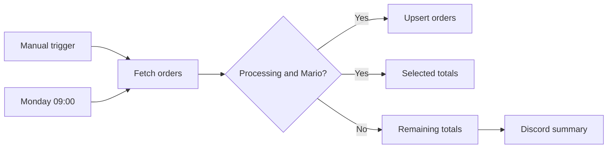

# n8n Academy QS101 — Automation Portfolio

[](https://learn.n8n.io/)


Professional portfolio of hands-on automation projects developed while completing the official **n8n Academy QS101: n8n Quickstart** course.

The repository documents practical experience with workflow orchestration, authenticated APIs, Data Tables, data transformation, report generation, binary files, Discord integrations, scheduling, JavaScript Code nodes, and production error monitoring.

> **Educational attribution:** The learning path and exercises are based on the official n8n Academy QS101 course. The workflow implementations, documentation, diagrams, validation pipeline, and repository organization are my own portfolio work. n8n and the n8n logo are trademarks of n8n GmbH.

## Course progress

| Module | Status | Projects |
| --- | :---: | --- |
| [01 — Getting Started](./01-getting-started/warehouse-order-processing/) | ✅ Completed | Warehouse Order Processing Automation |
| [02 — Working with Data](./02-working-with-data/) | ✅ Completed | Data Enrichment, Reporting, and Error Monitoring |
| 03 — Building an AI Agent | ⬜ Not started | Planned |
| 04 — Final Exam and Wrap Up | ⬜ Not started | Planned |

## Completed projects

### 01 — Warehouse Order Processing Automation

An automated warehouse pipeline that retrieves orders from an authenticated endpoint, applies business rules, calculates financial totals, updates an n8n Data Table, and sends a Discord summary. It supports both manual execution and a weekly Monday 09:00 schedule.

**Core capabilities**

- Manual and scheduled triggers
- Header-authenticated HTTP requests
- Conditional routing with combined `AND` rules
- JavaScript aggregation with Code nodes
- Data Table upsert operations
- Discord webhook notifications
- Timezone-aware scheduling



**[Open project documentation →](./01-getting-started/warehouse-order-processing/)**

---

### 02 — Data Enrichment, Reporting, and Error Monitoring

A connected three-workflow reporting system. It enriches customer records with geographic data, combines orders with customer information, calculates and filters sales totals, generates CSV reports, publishes regional summaries to Discord, and reports production failures through a reusable Error Workflow.


**Core capabilities**

- Data Table reads and row-level updates
- Dataset merging through matching fields
- Derived numeric fields, sorting, and filtering
- Regional aggregation and CSV conversion
- Binary report uploads
- Parallel workflow branches
- Discord summary notifications
- Reusable production Error Workflow

| Workflow | Responsibility | Documentation |
| --- | --- | :---: |
| Merging Data | Enrich customers with region and subregion data | [Open](./02-working-with-data/merging-data/) |
| Generating Reports | Build European CSV and regional summaries | [Open](./02-working-with-data/generating-reports/) |
| Monitor Report Errors | Notify the team about production failures | [Open](./02-working-with-data/error-monitoring/) |

**[Open complete module documentation →](./02-working-with-data/)**

## Repository organization

Each completed module contains importable workflow exports and focused documentation. Complex modules also include architecture diagrams in `assets/`.

```text
.
├── 01-getting-started/
│   └── warehouse-order-processing/
│       ├── README.md
│       └── workflow.json
├── 02-working-with-data/
│   ├── README.md
│   ├── assets/
│   │   ├── merging-data.svg
│   │   ├── generating-reports.svg
│   │   └── error-monitoring.svg
│   ├── merging-data/
│   │   ├── README.md
│   │   └── workflow.json
│   ├── generating-reports/
│   │   ├── README.md
│   │   └── workflow.json
│   └── error-monitoring/
│       ├── README.md
│       └── workflow.json
├── .github/workflows/
│   └── validate-workflow.yml
├── SECURITY.md
└── README.md
```

## Importing a workflow

1. Open the desired project directory.
2. Download its `workflow.json` file.
3. In n8n, select **Import from File**.
4. Configure your own authorized credentials and Data Tables.
5. Replace `YOUR_ASSESSMENT_ID` where required.
6. Review every node before executing or publishing the workflow.

## Quality and security

GitHub Actions validates every `workflow.json` committed to the repository. The validation checks JSON syntax, required n8n structure, and accidental inclusion of credential or instance metadata.

Public exports do not contain credentials, API keys, personal assessment IDs, private webhook URLs, workflow IDs, or private n8n instance metadata. Public n8n Academy exercise endpoints are retained only when they are necessary for reproducibility.

## Author

**Diego Rafael Leao Garcia**  
Automation and AI Engineering student focused on n8n, Python, APIs, databases, Docker, and applied artificial intelligence.

## Disclaimer

This is an independent educational portfolio and is not an official n8n repository. Refer to the official n8n Academy and n8n documentation for the original training material and certification path.
